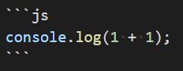
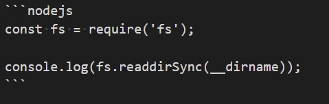
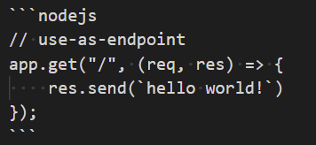

# Docsify runkit plugin example

## Demo

### plain javascript
```js
console.log(1 + 1);
```

Sourcecode for the snippet above:



### node.js
```nodejs
const fs = require('fs');

console.log(fs.readdirSync(__dirname));
```

Sourcecode for the snippet above:



Runkit embed endpoint (see `window.$docsify.runkitPlugin` in [configuration part](#configuration)):

```nodejs
// use-as-endpoint
app.get("/", (req, res) => {
    res.send(`hello world!`)
});
```

Sourcecode for the snippet above:




At the same time, other code snippets on other languages are ignored by the runkit-plugin:

```bash
echo hello
```

```php
some code on php
```

## Installation

Additionally to docsify, add plugin source and Runkit Embed sources:

```
  <script src="https://embed.runkit.com"></script>
  <script src="//unpkg.com/docsify-runkit-plugin/index.js"></script>
```

## Configuration

All config properties should be created under `window.$docsify.runkitPlugin`

```javascript
window.$docsify = {
    runkitPlugin: {
        // list of languages - for them runkit will be applied (default is ["js", "javascript"])
        languages: ["js", "nodejs"],
        // function to extend default options for runkit embed notebook
        getEmbedOptions: function(source, defaultOptions) {
            const mode = (source || "").includes("// use-as-endpoint") ? "endpoint" : "default";
            return {
                ...defaultOptions,
                source: source.replace('// use-as-endpoint', ''),
                mode,
                preamble: mode === "endpoint" ? 'const express = require("@runkit/runkit/express-endpoint/1.0.0"); const app = express(exports);' : '',
            };
        },
    },
}
```

## See more

* [Docsify](https://docsify.js.org/#/)
* [Runkit embed](https://runkit.com/docs/embed)
